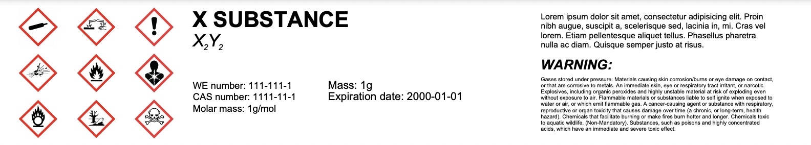

# Chemical Label Generator

Welcome to the Chemical Label Generator repository! This project provides a straightforward solution for generating chemical labels that can be easily printed and attached to bottles and containers. You can access and use the generator online by following the link [here](https://.com).

## Features

- **User-Friendly Interface:** Our intuitive web interface makes the label generation process simple and quick, eliminating the need for design skills. You won't have to worry about the design – just input the necessary information.

- **Swift Label Creation:** Generate clear and informative chemical labels in just a few clicks, saving you time and effort.

- **Print-Ready Labels in PDF:** The tool creates labels optimized for printing in PDF format. No design customization is needed, ensuring efficiency.

- **Useful for Various Purposes:** Whether you're a professional chemist, educator, or simply organizing household chemicals, our label generator caters to a wide range of users.

## Getting Started

To start using the Chemical Label Generator, you have two options:

### Option 1: Local Usage
1. Clone this repository to your local machine.
2. Open the "index.html" file in your preferred web browser.
3. Fill in the required fields, such as chemical name and hazard symbols.
4. Click the "Generate Label" button.
5. Review the generated label preview.
6. If satisfied, you can print the label directly or save it as a PDF for future use.

### Option 2: Online Usage
1. Visit [the online Chemical Label Generator](https://.com).
2. Fill in the required fields, such as chemical name and hazard symbols.
3. Click the "Generate Label" button.
4. Review the generated label preview.
5. If satisfied, you can print the label directly or save it as a PDF for future use.

## Example Label

## Contributions and Feedback

We welcome contributions to enhance this tool's features and usability. If you encounter any issues or have suggestions for improvement, please open an issue in this repository.